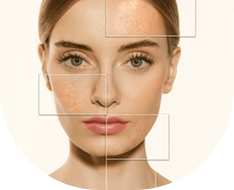

# Glowify - Skin Analysis & Beauty Assistant


## Overview

Glowify is a comprehensive Flutter mobile application designed to help users analyze their skin conditions and connect with beauty services. Using machine learning for skin analysis and featuring an AI-powered chatbot for skincare advice, Glowify serves as your personal beauty assistant.

## Features

### 🔍 Skin Analysis
- Upload photos for AI-powered skin analysis
- Get personalized skin condition reports
- Receive customized skincare recommendations

### 💬 AI Beauty Assistant
- Integrated chatbot powered by TensorFlow Lite
- Get instant answers to skincare and beauty questions
- Personalized advice based on your skin type and concerns

### 🏥 Salon Services
- Browse and connect with nearby beauty salons
- View salon details and available services
- Book appointments directly through the app

### 📝 Beauty Tips
- Access a curated collection of skincare tips
- Stay updated with the latest beauty trends
- Personalized recommendations based on your skin analysis

### 👤 User Account
- Create and manage your personal profile
- Track your skin improvement journey
- Save favorite salons and skincare routines

## Technical Stack

- **Frontend**: Flutter/Dart
- **Machine Learning**: TensorFlow Lite
- **Natural Language Processing**: Custom-trained chatbot model
- **Data Storage**: Local storage with path_provider
- **Image Processing**: Camera and image_picker plugins

## Installation

1. Clone the repository:
```bash
git clone https://github.com/yourusername/glowify.git
```

2. Navigate to the project directory:
```bash
cd glowify
```

3. Install dependencies:
```bash
flutter pub get
```

4. Run the app:
```bash
flutter run
```

## Dependencies

```yaml
dependencies:
  image_picker: ^1.0.7
  flutter:
    sdk: flutter
  cupertino_icons: ^1.0.8
  camera: ^0.10.5+9
  tflite_flutter: ^0.10.4
  path_provider: ^2.1.2
  animated_text_kit: ^4.2.3
  flutter_spinkit: ^5.2.1
```

## Project Structure

```
lib/
├── common/            # Common utilities and constants
├── common_widget/     # Reusable widgets
├── data/              # Data models and repositories
├── models/            # Business logic models
├── services/          # Service classes (API, ML services)
├── utils/             # Utility functions
└── view/              # UI screens
    ├── account/       # Account management screens
    ├── chat/          # Chatbot interface
    ├── favorites/     # Saved favorites screens
    ├── gallery/       # Image gallery views
    ├── home/          # Main screens including analysis
    ├── login/         # Authentication screens
    └── on_boarding/   # Onboarding experience
```

## Machine Learning Model

The application uses a custom-trained TensorFlow Lite model for both skin analysis and powering the chatbot assistant. The model files are stored in the `assets` directory:

- `chatbot_model.tflite`: The main model file
- `intents.json`: Training data for the chatbot
- `tokenizer.json` & `tokenizer.pickle`: Text tokenization configurations
- `label_encoder.json` & `label_encoder.pickle`: Label encoding configurations

## Screenshots




## Contributing

Contributions are welcome! Please feel free to submit a Pull Request.

## License

This project is licensed under the MIT License - see the LICENSE file for details.

